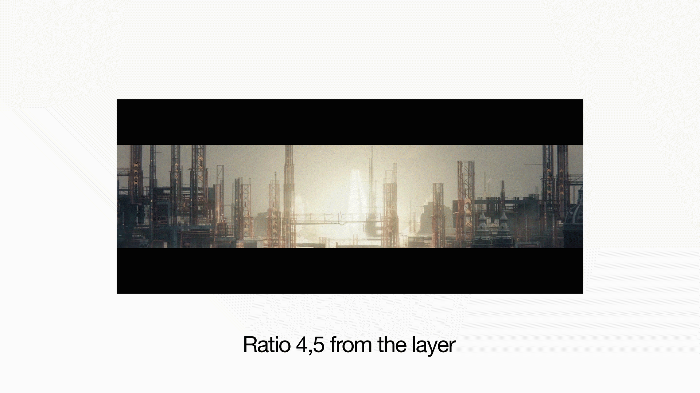
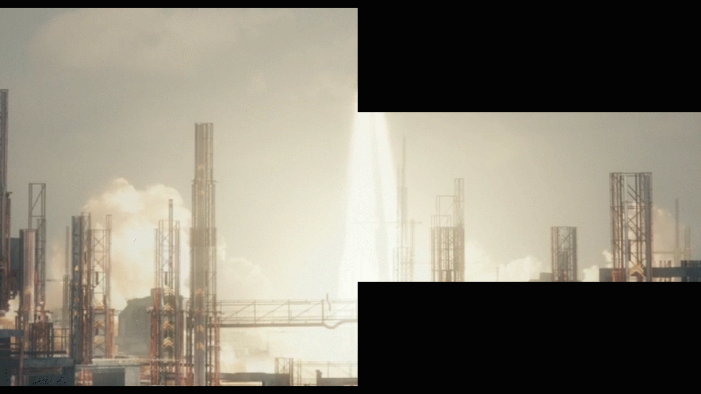

#Tl_letterbox Copyright Thomas Laforge 2017-2019

tl_letterbox is a Plugin for After Effect and Premiere that generates a letterbox with a ratio value. 
The plugin has some parameters :
- select the ratio a preset list or costum the value (from 0 to 10)

-change the color

-generate the letterbox on a transparent layer.

-Transform the picture begind the ratio (not andvaible in transparent mode)

-In After Effect only, the plugin can detect the ratio of the target layer

 
