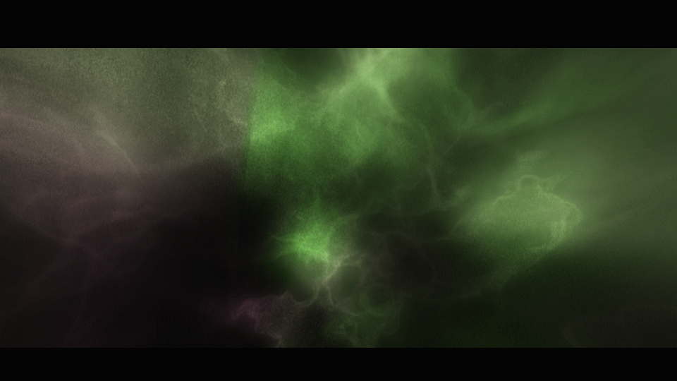

#Tl_letterbox Copyright Thomas Laforge 2017-2019

tl_letterbox is a Plugin for After Effect and Premiere that generates a letterbox with a ratio value. 
The plugin has some parameters :
- select the ratio a preset list or costum the value (from 0 to 10)

-change the color

-generate the letterbox on a transparent layer.

-Transform the picture begind the ratio (not andvaible in transparent mode)

-In After Effect only, the plugin can detect the ratio of the target layer

#Interface of the plugin

#choose the ratio of the boxes

#switch between ratio from the layer or the composition

#translate or resize the layer directly inside the plugin

detect the ratio from an other layer (After Effect Only)

 
